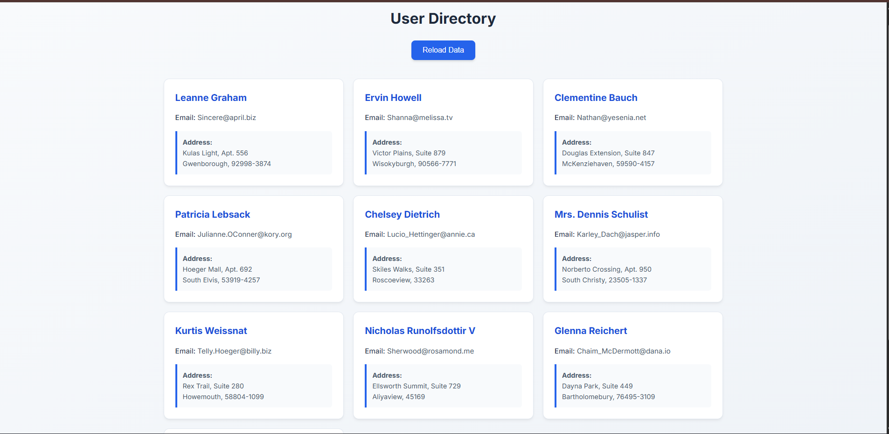

# Fetch API User Directory

This project is a solution for an internship task to demonstrate proficiency with asynchronous JavaScript. It fetches user data from the [JSONPlaceholder](https://jsonplaceholder.typicode.com/) public API and displays it on a webpage as responsive user cards.

## 📸 Demo


`## 📸 Preview
`

---

## ✨ Features

* **Dynamic Data Fetching:** Loads user data from a live REST API.
* **Asynchronous Code:** Uses modern `async/await` syntax for clean, readable code.
* **Loading & Error States:**
    * Displays a "Loading..." message while data is being fetched.
    * Shows a clear error message if the network request fails (e.g., if you are offline).
* **Responsive Design:** Uses CSS Grid to create a responsive card layout that adapts to different screen sizes.
* **Reload Functionality:** Includes a "Reload Data" button to refetch the API data.

---

## 🛠️ Tech Stack

* **HTML5:** Semantic HTML for structure (`<header>`, `<main>`, etc.).
* **CSS3:** Custom styling with CSS Grid for the layout, transitions, and a clean, modern UI.
* **JavaScript (ES6+):**
    * **Fetch API:** For making the `GET` request to the API.
    * **`async/await`:** To handle promises and asynchronous operations.
    * **DOM Manipulation:** To dynamically create and display the user cards on the page.

---

## 🚀 How to Run

Since this is a static front-end project, you can run it locally without any special server.

1.  **Clone the repository:**
    ```sh
    git clone [https://github.com/your-username/your-repo-name.git](https://github.com/your-username/your-repo-name.git)
    ```
2.  **Navigate to the project folder:**
    ```sh
    cd your-repo-name
    ```
3.  **Open the `index.html` file in your browser.**
    * You can simply double-click the file in your file explorer.

---

## 💡 Key Concepts Learned

This task was a practical exercise in several core front-end concepts:

* **Asynchronous JavaScript:** Understanding how to handle operations that don't block the main thread, such as network requests.
* **Fetch API:** Using the modern browser standard for making HTTP requests.
* **Promises:** Working with `Promise` objects, particularly using `async/await` as a cleaner alternative to `.then()` chains.
* **JSON Parsing:** Converting the JSON (string) response from the API into a usable JavaScript object with `response.json()`.
* **Error Handling:** Using `try...catch` blocks to gracefully manage network errors and `if (!response.ok)` to handle HTTP errors (like 404s or 500s).
* **DOM Manipulation:** Creating HTML elements from scratch (`document.createElement`) and adding them to the page (`userContainer.appendChild`) based on the API data.